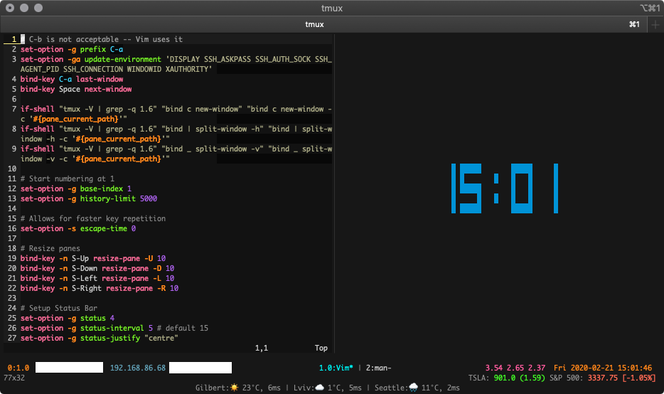

# tmux config

This is my tmux configuration which includes a multiline status bar and some helper scripts to add more information to the status bars.



## Stock

This script allows you to easily get stock information for any stock symbol.

Usage info is as follows:
```bash
usage: stock.py [-h] --symbol SYMBOL [--color-format {tmux,terminal}]
                [--percent-change] [--market-change] [--name]

optional arguments:
  -h, --help            show this help message and exit
  --symbol SYMBOL
  --color-format {tmux,terminal}, -c {tmux,terminal}
  --percent-change, -p
  --market-change, -m
  --name, -n
```

##### Examples

```bash
# Get the current S&P 500 value
$ python stock.py --symbol ^GSPC
^GSPC: 3337.75
```

```bash
# S&P 500 with market change
$ python stock.py --symbol ^GSPC -m
^GSPC: 3337.75 (-35.48)
```

```bash
# S&P 500 with market and percentage change
$ python stock.py --symbol ^GSPC -mp
^GSPC: 3337.75 (-35.48) [-1.05%]
```

```bash
# S&P 500 with market and percentage change, and full index name
$ python stock.py --symbol ^GSPC -mpn
S&P 500: 3337.75 (-35.48) [-1.05%]
```

```bash
# S&P 500 with market and percentage change, full index name, and tmux coloring
$ python stock.py --symbol ^GSPC -mpn -c tmux
#[fg=black]S&P 500: #[fg=#ff0000]3337.75 (-35.48) [-1.05%]
```

## Weather

Script that displays the current weather for a given GPS coordiante.

Usage:
```bash
$ weather --help
  weather -c [city] -l [latitude] -L [longitude]

  -c [city]      : (required) The name of the city you want to print for display purposes
  -l [latitude]  : (required) The latitude in signed degrees format DDD.dddd
  -L [longitude] : (required) The longitude in signed degrees format DDD.dddd
  -u             : (optional) Units can be either 'metric' or 'imperial' (default: metric)
  -h             : prints this help message

  example: weather -c Lviv -l 49.844146 -L 23.996637
```

## Get Active Network IP

Really basic bash script to try and get the current local network IP address on a Mac.